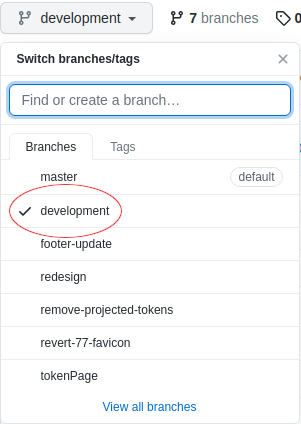
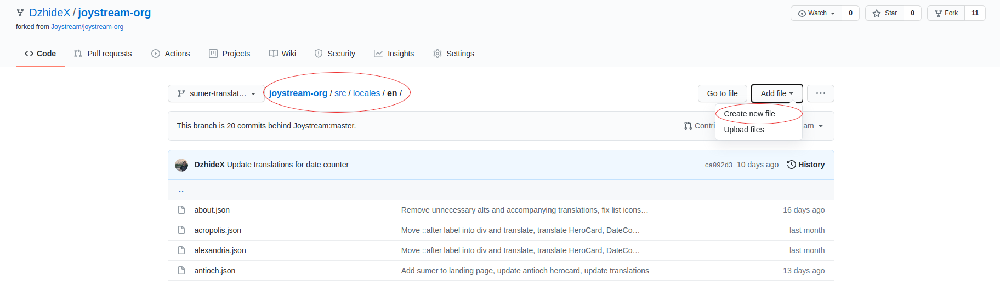
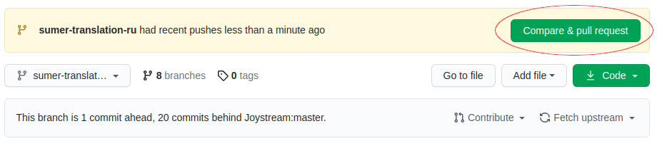

# Joystream-org i18n contribution guide

Firstly, we'd like to thank you for your interest in contributing to our internationalization project. Below you will be able to find a step-by-step explanation to help guide you through the process but also an overview of the necessary steps for the more advanced visitors to just skim through. If you have any questions or concerns, you are free to open an issue in [this repo](https://github.com/Joystream/joystream-org/issues) or get some help in [our discord community](https://discord.com/invite/DE9UN3YpRP).

*Even if you don't plan on adding any changes yourself, you are more than welcome to check out any active Pull Requests and join the discussion by recommending a different translation or giving any insight towards making the translations better.*

## Table of Contents

- [File Structure and Translation Process](#file-structure-and-translation-process)
- Contribution Process
  - [Option 1 (making the changes on your local machine and pushing the changes to GitHub)](#option-1)
  - [Option 2 (making the changes on GitHub's UI)](#option-2)
  - [Option 3 (download file locally and send changes through Discord)](#option-3)

## File Structure and Translation Process 

The translations are written in .json files and here is an example excerpt from one of them: `(/en/sumer.json)`

```js
{
  "sumer": {
    "siteMetadata": {
      "description": "Explore the Sumer testnet"
    },
    "hero": {
      "title": "Sumer Network",
      "text": "Among other changes, the Sumer testnet release offers major improvements to content uploads through our playback app."
    },
  ...
  }
}
```
To translate this file, you would need to:
- Find a file from `/src/locales/en` that has not yet been translated to your language (**check if there aren't any active PR's addressing the file as well**)
- Find the folder in `/src/locales` of the language you want to translate to
- Copy the file from `/en` to that folder (e.g. `/bs`) without changing the name of the file itself
- Finally, translate the text (**only change the values without changing any of the keys**)

After that is done, you will will then have something like this: `(/bs/sumer.json)`

```js
{
  "sumer": {
    "siteMetadata": {
      "description": "Istražite Sumer Testnu mrežu"
    },
    "hero": {
      "title": "Sumer Testna mreža",
      "text": "Između ostalih promjena, Sumer Testna mreža nudi velika poboljšanja pri prijenosu sadržaja putem naše aplikacije za reprodukciju."
    },
  ...
  }
}
```

## Contribution process

### Option 1:
For the users who are more familiar with the process of making code contributions on platforms like GitHub, you can follow these steps:

1. Fork the `joystream-org` repository and clone your fork
2. Create a branch (use descriptive names, e.g. `sumer-translation-ru`) and pull changes from the upstream `development` branch
3. Translate the file that you want to according to the previously explained rules
4. After you're done, push the changes and create a Pull Request (**make sure to write an explanatory title and add the** `internationalization` **label**)
5. In the description reference the issue pertaining to the translation and finish PR creation


### Option 2:
If you're not as familiar with git and the whole process of making contributions on GitHub, don't worry! Here is a detailed explanation to make sure that you can also contribute to our project:

**Step 1:** Fork the joystream-org repository to your own account.


**Step 2:** Go to your fork and switch over to the development branch.



**Step 3:** If your branch is behind, make sure to pull the latest changes.


**Step 4:** Find the file you wish to translate (that still hasn't been translated) and create a branch that explains exactly what you wish to do. In this example we've used `sumer-translation-ru` to signify that we are translating the sumer testnet file into russian. You don't have to use this exact naming convention but make sure that it is clear what changes you've made!


**Step 5:** Go to your new branch and inside of it navigate to `src/locales/${language-code}` and click *Create new file*.



**Step 6:** Here you need to name the file to be the same as the file you've picked to translate from `src/locales/en`. In this example that would be `sumer.json`. After you've done that, you can copy the `sumer.json` file from `src/locales/en` and proceed to translate only the values (as denoted below by the arrows).


**Step 7:** After you've finished translating the file you should write a meaningful commit message to describe the work you've done. After that you can push commit new file.


**Step 8:** Now you can go back to your fork and you will be greeted by a new message that will let you know that the changes you've made have indeed been "saved". You can now click *Compare & pull request*



**Step 9:** In this final step, make sure to change the branch to development and then fill out all the necessary PR metadata. Your title and description should meaningfully explain your changes (you can use the example below to get a better idea of what to do). Please don't forget to reference the issue that tracks the translations you're making and also add the `internationalization` label. And finally, after all this hard work you can press *Create pull request*. Thank you! 🎉


### Option 3:
If you're not at all familiar with git and how it works but still would love to contribute to the internationalization project, don't worry! In this last option you can download the json file and translate the necessary text as explained above in the [File Structure and Translation Process](#file-structure-and-translation-process) and send the translated text to DzideX#9084 on Discord. You will then be correctly attributed for having translated the file in the PR that will be made. Be sure to send your Testnet profile username if you wish to be awarded founding members points as well!