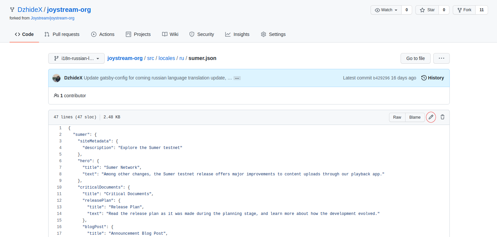
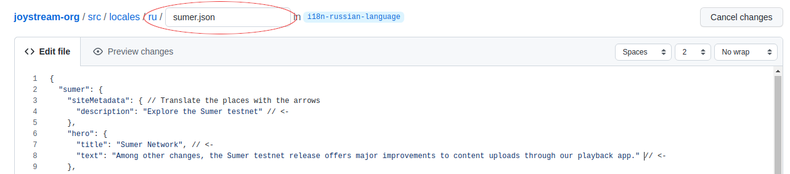
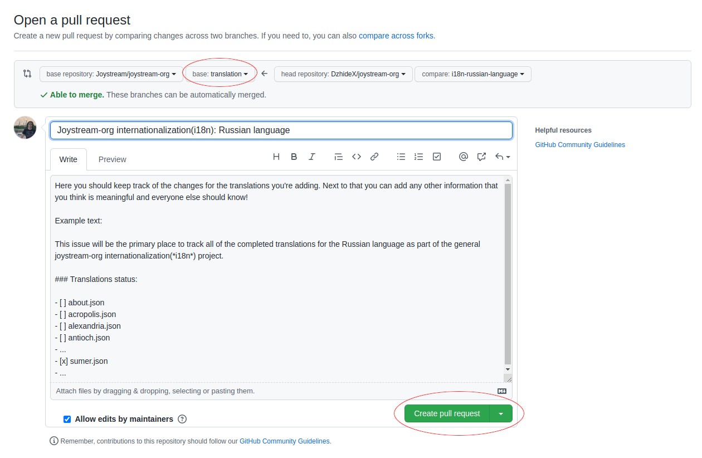

# Joystream-org i18n contribution guide

Firstly, we'd like to thank you for your interest in contributing to our internationalization project. Below you will be able to find a step-by-step explanation to help guide you through the process but also an overview of the necessary steps for the more advanced visitors to just skim through. If you have any questions or concerns, you are free to open an issue in [this repo](https://github.com/Joystream/joystream-org/issues) or get some help in [our discord community](https://discord.com/invite/DE9UN3YpRP). If you need help specific to the internationalization project, you're welcome to ask questions in the `#joystream-org-translation` channel.

*Even if you don't plan on adding any changes yourself, you are more than welcome to check out any active Pull Requests and join the discussion by recommending a different translation or giving any insight towards making the translations better.*

## Table of Contents

- [File Structure and Translation Process](#file-structure-and-translation-process)
- Contribution Process
  - [Option 1 (making the changes on your local machine and pushing the changes to GitHub)](#option-1)
  - [Option 2 (making the changes on GitHub's UI)](#option-2)
- [Seeing the changes](#seeing-the-changes)

## File Structure and Translation Process 

The translations are written in .json files and here is an example excerpt from one of them: `(src/locales/en/sumer.json)`

```js
{
  "sumer": {
    "siteMetadata": {
      "description": "Explore the Sumer testnet"
    },
    "hero": {
      "title": "Sumer Network",
      "text": "Among other changes, the Sumer testnet release offers major improvements to content uploads through our playback app."
    },
  ...
  }
}
```
To translate this file, you would need to:
- Find the folder in `/src/locales` that corresponds to the language you want to translate to
- Find a file in that folder (ex. `/src/locales/bs`) that has not yet been translated to that language
- The translations in that file will be in English. You can now translate those values to the language corresponding to the locale (**only change the values without changing any of the keys**)

After that is done, you will will then have something like this: `(src/locales/bs/sumer.json)`

```js
{
  "sumer": {
    "siteMetadata": {
      "description": "Istražite Sumer Testnu mrežu"
    },
    "hero": {
      "title": "Sumer Testna mreža",
      "text": "Između ostalih promjena, Sumer Testna mreža nudi velika poboljšanja pri prijenosu sadržaja putem naše aplikacije za reprodukciju."
    },
  ...
  }
}
```

## Contribution process

### Option 1:
For the users who are more familiar with the process of making code contributions on platforms like GitHub, you can follow these steps:

1. Fork the `joystream-org` repository and clone your fork

```
git clone https://github.com/${your-github-username}/joystream-org.git
```

2. Create a branch (use descriptive names, e.g. `i18n-russian-language`) and pull changes from the upstream `translation` branch

```
git checkout -b <branch_name>
git remote add upstream https://github.com/Joystream/joystream-org.git
git pull --rebase upstream translation
```

3. Run development environment locally. For more detail and specific steps you can visit the [Seeing the changes](#seeing-the-changes) section.

4. Translate the file that you want to according to the previously explained rules

5. After you're done, push the changes and create a Pull Request (**make sure to write an explanatory title and add the** `internationalization` **label**)

```
git add .
git commit -m "Translate sumer.json into russian"
git push // you may also have to add: --set-upstream origin <branch_name>
```

6. In the description reference the issue pertaining to the translation and finish PR creation


### Option 2:
If you're not as familiar with git and the whole process of making contributions on GitHub, don't worry! Under this section is a detailed explanation to make sure that you can also contribute to our project. That being said, it would be very difficult to be able to see the changes your new translations make to the layout of the page and may take even longer (with something like inspect element) compared to the previous way. We therefore recommend users to invest a little bit of time into learning the first option.

**Step 1:** Fork the joystream-org repository to your own account.


**Step 2:** Go to your fork and switch over to the translation branch.


**Step 3:** If your branch is behind, make sure to pull the latest changes.


**Step 4:** Find the file you wish to translate (that still hasn't been translated) and create a branch that explains exactly what you are doing. In this example we've used `i18n-russian-language` to signify that we are translating the joystream-org to Russian.


**Step 5:** Inside of the new branch navigate to `src/locales/${language-code}/${file-name}` (where `language-code` is the language you want to translate into and the `file-name` the name of the file you wish to translate) and click on the edit file icon.



**Step 6:** You can now translate the file by updating only the values of the key-value pairs (the strings next to the arrows in the image below). Make sure to adapt the translation as necessary to better fit the layout in the given situation.



**Step 7:** After you've finished translating the file you should write a meaningful commit message to describe the work you've done. After that you can push commit new file.


**Step 8:** Now you can go back to your fork and you will be greeted by a new message that will let you know that the changes you've made have indeed been "saved". You can now click *Compare & pull request*


**Step 9:** In this final step, make sure to change the branch to translation and then fill out all the necessary PR metadata. Your title and description should meaningfully explain your changes (you can use the example below to get a better idea of what to do). Please don't forget to also add the `internationalization` label. And finally, after all this hard work you can press *Create pull request*. Thank you! 🎉



**Step 10:** You can now continue adding translations to the same PR until you're done with the scope of the tasks explained in the Bounty.

## Seeing the changes

As languages have great variance in the amount of data they can convey for the same amount of words/characters, the layout of the website due to the changes can therefore be greatly compromised. We understand that a lot of the time there isn't much that can be done in this regard, but in the cases where it is possible we implore you to explore different translations to make sure that the integrity/layout of the component being affected by your change is kept as much as possible in its original form.

There are multiple ways for you to be able to track how the component will behave based on your changes:

1. You can run the website locally and by doing that you will be able to directly change the desired file and be able to see the effects of your change upon saving. To get started with this, the [explanation at the root of the repository](https://github.com/Joystream/joystream-org) should be able to help you. Once you have the development environment running, navigate to the page you wish to translate and append `/${language-locale}` (ex. `/ru`) to the base of the url. You will then have something along the lines of `http://localhost:8000/ru/` for the index page or something like this for a more complex route `http://localhost:8000/ru/brand/story`.

2. A simpler way to see how your new translation will affect the component is to simply use inspect element and change the text of the components to the new translation you plan to add.
